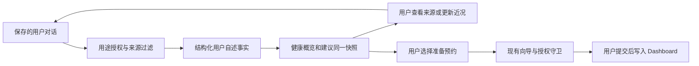

# 对话历史与个性化健康 Dashboard：前后端双 Agent 实施报告

> 依据：2026-09-28 用户需求、两张界面参考图，以及当前 `C:\Project\bupa` 源码。本文是实施与交接规格，本轮只编写报告，没有实现下述新功能。文中的「应当」「新增」「阶段」均表示待开发事项。
>
> 阅读对象：前端 Agent（FE）和后端 Agent（BE）。先共同阅读第 1–6 节，再分别执行第 7 节任务；第 8–11 节为共同契约、接入规则和验收要求。

## 1. 要实现的产品变化

本次目标是把一次性的聊天与预约工具，扩展为能够延续用户上下文的健康服务助手。评委应当能看懂这一条因果链：**用户曾经告诉过我们什么 → 经允许保留并用于个性化 → Dashboard 展示有来源的概览 → 提出与这段经历有关的下一步 → 用户自行决定是否行动。**

### 1.1 三项功能，组成一个闭环

| 功能                                  | 用户看到什么                                     | 实际行为                                                                                 |
| ------------------------------------- | ------------------------------------------------ | ---------------------------------------------------------------------------------------- |
| 多对话历史                            | 左侧的新对话按钮、历史列表、当前选中项、删除入口 | 每段有内容的对话独立保存，可以跨页面、刷新后重新打开并继续；新对话不会清空旧对话         |
| Health Overview / 健康概览            | Dashboard 顶端的一张简明概览卡                   | 从获准使用的历史对话提取少量有来源的健康关注事项，显示报告时间、最近提及时间和待更新状态 |
| Personalized Suggestions / 个性化建议 | 与概览关联的行动卡及「为什么建议这个」           | 根据历史关注事项提供询问近况、准备 GP 预约等入口，复用现有预约向导，由用户确认提交       |

这里的 Health Report 采用轻量的 **Health Overview** 产品形态：它是用户自述信息的整理，不是诊断报告、病历、健康评分或模型推断的病情结论。无需引入复杂图表，也不需要大段医学内容。

图 2 只参考「侧栏历史列表 + 中间当前对话」的交互结构。沿用当前网站的 Bupa 蓝色、卡片和中英双语风格，不复制截图里的 Codex 项目管理、黑色主题或其他聊天内容。

### 1.2 两个阶段的界限

| 阶段                       | 必须交付                                                           | 数据与模型                                                        | 不以什么作为完成标志                                 |
| -------------------------- | ------------------------------------------------------------------ | ----------------------------------------------------------------- | ---------------------------------------------------- |
| 第一阶段：前端演示         | 可交互、可刷新恢复、可删除的历史；手臂受伤概览；关联建议；预约闭环 | 浏览器本地虚构数据、确定性演示逻辑，使用现有 `VITE_API_MODE=mock` | 截图、只写死一张卡、每次刷新重新塞回删除过的数据     |
| 第二阶段：服务端与真实模型 | 持久化历史、授权过滤、真实历史理解、概览与建议更新、HTTP 联调      | 服务端存储 + 真实模型适配器；保留明确标记的离线演示模式           | 仅把一句 prompt 发给模型，或失败时偷偷回退到手臂模板 |

第二阶段「真正处理各种情况」是指能识别不同输入并选择有依据的处理或回退路径，不承诺所有疾病、所有医疗判断都能由模型解决。真实模型接入也不等于接入真实 Bupa 会员、保险或诊所预约系统；后者仍保持当前演示边界。

## 2. 已核实的当前代码基线

以下是源码检查结果。未在本次重新启动服务、运行测试或做浏览器验收；旧文档中的测试通过记录不能当作本次验证结果。

| 区域             | 当前实现                                                                                                                                                                                                             | 新需求的接入位置                                                                                           |
| ---------------- | -------------------------------------------------------------------------------------------------------------------------------------------------------------------------------------------------------------------- | ---------------------------------------------------------------------------------------------------------- |
| 应用外壳         | [app.tsx](C:/Project/bupa/apps/web/src/app.tsx) 提供固定宽度主导航、三页面切换、语言切换与重置演示                                                                                                                   | 在已有左侧导航下加入历史区，避免额外增加一整列挤压聊天和右侧向导                                           |
| 聊天页面         | [chat/page.tsx](C:/Project/bupa/apps/web/src/features/chat/page.tsx) 提供时间线、输入框、右侧上下文/预约面板                                                                                                         | 保留这些能力，增加当前对话选择及恢复                                                                       |
| 聊天状态         | [stores/chat.ts](C:/Project/bupa/apps/web/src/stores/chat.ts) 只有一组 `items`、`running`、`pendingConsentId`，一个模块级 AbortController，前端 `sessionId` 固定为 `session-demo`；「新对话」调用 reset 清空当前内容 | 改为以 conversationId 定位的记录和运行状态；新建、切换、删除、重置必须分开                                 |
| 时间线           | [timeline.tsx](C:/Project/bupa/apps/web/src/features/chat/timeline.tsx) 不只有文本，还展示工具、授权、回执、向导、预约、安全及错误事件                                                                               | 持久化不能只保存 user/assistant 两类文字；恢复时不能重新执行历史卡片的副作用                               |
| Dashboard        | [dashboard/page.tsx](C:/Project/bupa/apps/web/src/features/dashboard/page.tsx) 显示统计、日历、草稿、预约、提醒和备注                                                                                                | 在页面标题下、日程统计上方增加健康概览，再放关联建议；保留现有日程能力                                     |
| 当前 suggestions | 文案为「为你准备 / For you」（`dash.cards`）；数据来自 `Schedule.cards` 与 [fixtures.ts](C:/Project/bupa/packages/contracts/src/fixtures.ts) 的 `demoCards`                                                          | 用户所说的 AS-suggestions 按这块理解。现在是固定卡片，不是基于聊天生成；新增健康建议应有独立来源与生命周期 |
| 建议进入聊天     | `DashboardPage.askAgent()` 直接向全局聊天 store 发送 prompt                                                                                                                                                          | 新实现必须明确目标对话，不能将健康建议接到任意正在打开的旧话题中                                           |
| API 适配         | [lib/api.ts](C:/Project/bupa/apps/web/src/lib/api.ts) 已有统一 mock/http adapter；默认 mock，HTTP 经 `/api` 代理访问 Hono                                                                                            | 在同一模式开关下扩展契约；禁止一次流程里混用本地历史与服务端预约状态而不说明来源                           |
| 浏览器存储       | MockService 的业务状态在内存；源码中只有语言偏好使用 localStorage                                                                                                                                                    | 刷新后历史、演示建议状态和相关已完成业务结果需要新增持久化                                                 |
| 后端业务         | [app.ts](C:/Project/bupa/apps/api/src/app.ts)、`booking.ts`、`permissions.ts`、`providers.ts` 已实现写入、授权、预约状态机、取消改期与 SSE                                                                           | 复用现有业务，新增历史/概览模块，不从头重做预约后端                                                        |
| 后端会话         | [sessions.ts](C:/Project/bupa/apps/api/src/sessions.ts) 使用 30 分钟空闲 TTL；`app.ts` 使用服务端生成的 HttpOnly `bupa_session` cookie                                                                               | 它管理授权、草稿及运行请求，不是长期对话 ID，也不是真实会员登录认证                                        |
| 存储与身份       | [store.ts](C:/Project/bupa/apps/api/src/store.ts) 是内存 DemoStore，默认共享 Lin 演示会员，重启恢复 fixture                                                                                                          | 第二阶段新增持久层与明确的 owner 边界；仅增加 conversationId 不会自动得到用户隔离                          |
| 模型             | [agent.ts](C:/Project/bupa/apps/api/src/agent.ts) 为规则型 ScriptedLLM；`AgentModel.plan(message)` 是同步接口，`mode` 仅允许 demo；`config.ts` 仅支持 `DEMO_MODE=true`                                               | 需要真正的异步模型适配及结构化历史理解，不是只填入一个 API key                                             |
| 契约与测试       | `packages/contracts` 当前 0.2.0；`apps/api/test` 已有预约、权限、会话、SSE 等回归测试                                                                                                                                | 增量扩展契约，保留既有事件和预约语义；新增针对历史与个性化的检查                                           |

**文档漂移：**README、`docs/architecture.md` 仍称后端只有只读接口，已不符合源码；`docs/backend-integration.md` 更接近现状。后续 Agent 以源码为基线，并由 BE 在自己的文档任务中修正旧说明。

**产品范围变化：**原产品定义第 7 节明确将症状限制在当次对话、不存入档案。本次用户明确提出历史保存与跨对话健康概览，是新增范围。应新增独立的历史与健康记忆域，而不是把症状塞进 Profile 字段；保留原有字段授权守卫，不通过放宽全部敏感权限来实现记忆。

## 3. 对话历史的完整交互规格

### 3.1 侧栏与创建

1. 主导航保留 Chat、Dashboard、Profile。导航下方放「新对话」和可独立滚动的历史列表，底部语言/会员信息仍可见。
2. 点击任意历史项，进入 Chat 并激活对应对话。Dashboard 的「查看来源」也走同一套选择逻辑，并定位到具体消息。
3. 点击「新对话」显示空白输入页；第一条消息发送时正式创建并保存记录。反复点新对话不积累空白历史。若一定要预先创建 ID，空白记录不进入常规列表。
4. 首条用户消息生成简短标题，前端阶段用确定性截断即可。模型标题、搜索、置顶、文件夹、重命名不是本次必需功能。
5. 按 `updatedAt` 倒序，可分「今天 / 昨天 / 更早」。读取不更新排序，新增消息才更新；标题、日期、选中状态和删除入口清晰。

### 3.2 保存与恢复

- 用户消息发送即保存；助手完整消息和有展示价值的工具/业务结果持续保存。不能依赖离开页面、window unload 或正常收到 done 才落盘。
- 页面跳转、刷新、关闭再打开同一浏览器后，可恢复已保存历史与上次选中项。未发送输入不属于聊天历史；第一阶段不要求跨设备同步。
- 对话时间保存 ISO 时间，界面按澳洲本地日期显示；消息顺序用稳定序号，不仅依赖时间戳。
- 文本、标题、翻译、原始消息时间和稳定 ID 需要恢复。工具的进度行按稳定 ID 更新，不能每次 running/done 都变成两条。
- 预约、回执、草稿等使用实体引用恢复。已失效的草稿或 consent 显示「已过期 / 请重新开始」，不能恢复为可点击的有效授权。
- 保存中的错误必须可见：存储配额、解析损坏、HTTP 保存失败不能显示「已保存」。保留内存中的输入并提供重试，不静默清空所有记录。
- 初始化完成前不发送新消息或重新注入 seed，防止空初始状态覆盖已经保存的数据。

### 3.3 切换、运行中消息与预约归属

本次采用容易验收的行为：**切换到另一段对话或新建对话时，停止原对话尚未完成的一轮生成；页面从 Chat 跳到 Dashboard 本身不代表新建对话。**

- abort 后保留已产生的内容，将未完成轮次标记为 interrupted；不恢复成无限加载，不把取消当作普通失败红框。
- 所有异步回调捕获发起时的 conversationId 和 turnId。旧请求的 catch/finally、SSE 事件不能改变新对话的 running、items、授权卡或右侧向导。
- 服务端中断需要释放 consent waiter 和运行锁。若下一次发送暂时返回 CHAT_BUSY，前端有可恢复状态；不能伪造新授权会话来绕过冲突。
- 切换时关闭旧对话右侧面板；只有用户明确恢复该对话有效草稿时才重新打开。对话与 draft 建立归属关系，`openDraftId` 必须属于发起消息的对话/合法会话。
- 预约提交完成后，将结果写回草稿所属的对话，而不是提交完成瞬间恰好选中的对话。原来的 `notifyBooking(..., inChat)` 需要显式的 conversationId 或从 draft 元数据查得归属。
- 重新加载历史只渲染记录，不重发旧 prompt、不重复授予权限、不重新打开全部向导、不重复提交预约。

### 3.4 删除

| 操作                     | 必须发生                                             | 必须保留的业务语义                                         |
| ------------------------ | ---------------------------------------------------- | ---------------------------------------------------------- |
| 删除非当前对话           | 确认对话中说明影响；删除成功后列表消失，当前聊天不变 | 删除失败保留记录，给出可重试提示                           |
| 删除当前对话             | 停止其运行请求，关闭其面板，删除后进入空白新对话     | 不能由迟到的 SSE 或旧加载响应把对话重新插回来              |
| 删除概览来源对话         | 立即使对应概览/建议失效，再根据其他有效来源重算      | 不能仍展示已删除文本或继续给模型注入该内容                 |
| 删除带有已确认预约的聊天 | 删除聊天及派生健康信息，解除引用                     | 已确认预约、必要操作回执不因此被取消；取消预约仍用原有入口 |
| 删除关联未提交草稿的聊天 | 停止该对话执行，清理源自该对话的未提交草稿及自动预填 | 用户在别处独立创建的草稿不受影响                           |

删除是明确的内容删除，不是仅隐藏列表项。可用不含正文的 tombstone 防止旧请求恢复数据，但不可用软删除后继续让模型读取原文。第一阶段删除的演示对话在普通刷新后不得自动复活；只有「重置演示」会再次生成示例。

## 4. Dashboard 健康概览与建议

### 4.1 页面顺序与信息量

```text
Dashboard / 我的健康
  健康概览                         最近更新 · 演示/真实处理标识
    一句话摘要
    1–3 个关注事项：来源时间、用户自述、当前状态、查看来源/更新近况
  为你准备 / For you
    与关注事项关联的建议 · 为什么出现 · 行动按钮 · 暂不需要
  预约/提醒统计
  现有日历、预约、草稿、提醒和备注
```

- Health Overview 放在页面顶部，不藏在日历侧栏下方。宽度占主内容区域，控制文字长度，第一屏能同时看到概览与建议入口。
- 每项至少包含：问题的简明名称、用户上次怎么描述、何时描述、当前状态是否已更新、消息来源链接。明确区分 `generatedAt` 和 `lastReportedAt`。
- 状态采用「尚未更新近况 / 用户表示仍有不适 / 用户表示好转 / 用户表示已恢复」，不用未经医疗确认的「已痊愈」或风险评分。
- 无相关历史：展示说明和「开始对话」入口；未开启个性化：展示用途说明与开启入口；生成失败：展示失败/重试状态。均不得显示手臂示例充数。
- 对合法且未被删除/撤权的旧概览，可以标记「正在更新」后暂时展示；被删除或撤回授权影响的内容必须立即隐藏，不能以 stale 缓存继续显示。
- 原有保单类固定卡片可保留，但标明它们来自保单/演示资料；健康历史建议标明来自哪段历史，避免把两者混成同一种数据来源。

### 4.2 第一阶段唯一主场景：两周前的手臂受伤

统一 fixture 的 `demoNow` 在首次初始化时确定并保存，历史消息时间为它的前 14 个本地日。重置演示才重新设定；后续刷新按真实当前日期显示经过时间，不在每次渲染时把消息改回「正好两周前」。测试使用注入时钟。

| 场景要素         | 固定内容或规则                                                                                             |
| ---------------- | ---------------------------------------------------------------------------------------------------------- |
| 历史对话标题     | 手臂受伤咨询 / Arm injury                                                                                  |
| 两周前用户消息   | 「我的胳膊受伤了，我觉得伤得很严重。」/ “I injured my arm and it feels serious.”                           |
| 事实边界         | 只知道用户当时自述手臂受伤、程度严重；不知道左/右、骨折与否、诊断、处理方式、是否已经看过 GP、现在是否恢复 |
| 概览示例         | 「你在约两周前提到手臂受伤，并描述伤势较重。我们还没有收到你最近的恢复情况更新。」                         |
| 概览状态         | 尚未更新近况 / Recovery update not provided                                                                |
| 建议示例         | 「想和 GP 确认一下手臂的恢复情况吗？我可以帮你准备一次预约，由你确认是否提交。」                           |
| 推荐原因         | 「因为你在这段对话中提到过手臂受伤。」并提供来源跳转                                                       |
| 未确认的复诊信息 | 默认说「预约 GP 检查/咨询」，不编造已经看过 GP 的记录；只有历史确实支持时才称为复诊或再次预约              |

该示例是虚构的产品演示素材。首次进入 mock 演示可预置「个性化已开启（演示设置）」并显示演示标识，使评委立即看到完整体验；不能把这一预置说成真实用户已经同意。

### 4.3 建议的三条路径

1. **更新近况**：打开原对话并定位相关消息，在输入框给出可编辑的提示，用户发送后更新概览。演示支持明确的「已恢复」「好一些但仍不舒服」「仍担心」三个分支；其他输入走普通对话，不能一律判定已恢复。
2. **准备 GP 预约**：明确点击后，创建/恢复一段专用于此次后续咨询的对话，带上来源引用与建议 ID，再请求助手准备预约。复用当前字段授权和五步向导，不生成额外预约表单。
3. **暂不需要**：持久保存 dismissed 状态，不删除原始健康关注事项；同一条建议不能因为重新生成 report 就再次出现。用户给出新的情况时才可生成有新依据的建议。

预约关联规则：点击建议、生成草稿都不代表已经预约。只有原有 submit 接口成功后，建议才显示「已安排 GP 预约」并链接到预约记录；同一事项不再重复推荐相同预约。预约成功不是恢复健康的证据，不能把健康状态自动改成已恢复。取消关联预约后转成「安排已取消，可重新准备」，避免继续显示已安排或无条件重复催促。

使用 `suggestionId / dedupeKey / conversationId / draftId / bookingId` 串起这条链。按钮不能只发送一条与来源无关的固定字符串；双击、网络重试也不得创建多段重复后续对话或多个预约。

### 4.4 保存、个性化使用与删除是不同的操作

- **保存聊天**：按本次需求，对已发送的对话自动保存，供用户重新打开和删除；在历史区说明存储位置。第一阶段只放虚构数据，本地浏览器清理站点数据也会清除历史。
- **跨对话个性化**：新增独立设置，说明使用历史健康描述生成概览和建议、可随时关闭。真实数据路径默认关闭，用户明确开启后才允许提取、生成和跨对话使用。
- **关闭个性化**：聊天仍可查看；删除派生健康事实/概览/建议，停止相关后台任务与未来上下文注入。重新开启后才按当前仍存在的历史重新生成。
- **删除聊天**：源记录及其派生内容一起失效。即使一条派生事实还有其他来源，也必须重新核实，删除相应引用，不能保留仅由已删消息支撑的细节。
- 现有 Profile 字段授权和 `mentalHealthNeed` 的 session 限制继续有效。新的健康历史设置不是把所有字段/敏感类别都升级成 always；处理已有特别敏感类别时仍需相应用途授权，不允许通用开关旁路。
- 用途说明与回执不复制完整症状正文。不把原始聊天、健康事实放进通用日志、前端分析事件或 URL 参数。

## 5. 数据流与架构决定



### 5.1 三个 ID，不能混用

| ID                | 责任                             | 生命周期                                        |
| ----------------- | -------------------------------- | ----------------------------------------------- |
| member/owner ID   | 决定谁有权读取和删除数据         | 服务端可信身份；当前只有明确标记的 Lin 演示身份 |
| cookie session ID | 现有临时权限、执行请求、草稿校验 | 30 分钟空闲会话；到期不能恢复 session 授权      |
| conversationId    | 标识一段长期保存的对话           | 保存后直到删除，跨多个授权会话仍可存在          |

长期记录归属会员，执行时重新建立有效 session。不得将浏览器传入的 memberId 或 conversationId 当作访问授权。重新打开历史也不意味着旧 session 的草稿和授权重新有效。

### 5.2 第一阶段

- 使用统一的本地 Repository，建议以 IndexedDB 保存版本化数据；页面和 zustand 不直接各自写不同 localStorage key。若选择其他本地存储，实现同样的版本、异常和一致性要求即可。
- mock adapter 实现第 8 节接口，驱动与第二阶段相同的组件。演示解析器只覆盖第 4.2–4.3 节的明确分支，输出与未来服务端一致的 DTO。
- 持久保存：会话/消息、演示初始化标记、个性化设置、事实来源、报告修订号、建议状态，以及此流程生成的已确认预约、备注、提醒和回执，保证刷新后历史中的业务引用仍可读取。
- 不序列化 AbortController、Promise、监听器、等待中的 consent resolver 或临时权限对象。刷新后未完成轮次结束为 interrupted；不能把 session 权限永久保存。
- 未提交草稿按既有会话有效性处理；过期显示不可继续，并可重新准备。不要为了恢复旧聊天，恢复过期的敏感预填。
- 只在数据库尚未初始化时注入示例。无论用户删掉最后一条对话、关闭个性化还是清空概览，普通刷新都不得重新播种。
- 「新对话」「删除一条历史」「重置全部演示」分别实现；后者清除本地演示域、运行任务和缓存后重新播种，不用新对话替代。
- 第一阶段验收使用完整 mock 模式；保留已有 HTTP 预约/对话路径。服务端尚无新接口时，HTTP UI 明确显示新能力未启用，不能后台偷用 mock 假装服务端已支持。

### 5.3 第二阶段

- 新增服务端 Repository 与迁移，采用可在重启后恢复的存储。建议本地开发从 SQLite 起步；具体驱动、迁移命令由 BE 确认后集中加入依赖，不规定未经验证的库版本。
- 会话/消息/授权设置/事实及证据/概览修订/建议状态是持久数据；运行锁、AbortController、等待者是运行时状态。服务重启后未完成任务进入可恢复或 interrupted 状态。
- 现有 DemoStore 中仍在内存的相关预约、回执也必须有明确持久化或可恢复引用策略。第二阶段的端到端「重启恢复」不能只恢复聊天却把关联预约全变成不存在。
- Repository 的所有读写都携带服务端 owner；为其他 owner 的 ID 返回不可访问，不泄露存在性。可继续做单会员演示，但不能宣称完成真实登录或生产多租户安全。使用真实多用户数据前必须接入可信认证。
- 模型只从服务端调用；密钥不进入 `VITE_` 变量、浏览器 bundle、仓库或报告。以当前项目选定的模型供应方为准，先实现可替换适配器。
- 第一阶段浏览器演示数据不自动上传给模型或迁移到服务端。HTTP 模式初始化自己的明确标记 fixture；模式切换清理前端缓存并区分数据源。

## 6. 两位 Agent 的文件所有权与协作协议

保留 `docs/backend-integration.md` 已约定的共享契约由前端维护这一规则。**同一文件只能有一个写入方。**两位 Agent 可以阅读整个仓库，但必须遵守下表的写入范围。

| 文件/目录                                                                                    | 唯一写入方                  | 说明                                                                  |
| -------------------------------------------------------------------------------------------- | --------------------------- | --------------------------------------------------------------------- |
| `apps/web/**`，包括其 package.json                                                           | FE                          | 所有 UI、浏览器 mock、API adapter、状态、前端测试                     |
| `packages/contracts/**`                                                                      | FE                          | 新 schema、公共 DTO、fixtures 与导出；BE 提出需求，由 FE 落文件       |
| `apps/api/**`                                                                                | BE                          | 路由、持久层、模型、提取/聚合、授权、后端测试                         |
| 根 package.json、pnpm-lock.yaml、pnpm-workspace.yaml、`.env.example`、`.gitignore`           | BE，作为此次集成负责人      | 根脚本、依赖安装、锁文件、后端环境说明；FE 不同时运行会改锁文件的安装 |
| README、`docs/architecture.md`、`docs/backend-integration.md`、`docs/implementation-plan.md` | BE                          | 修正文档漂移与运行说明                                                |
| `docs/frontend-integration.md`、新增 `docs/frontend-personalization-status.md`               | FE                          | 前端实现、mock 约定、交付状态与未完成项                               |
| 新增 `docs/backend-personalization-status.md`                                                | BE                          | 契约反馈、后端进展、环境和验证记录                                    |
| 本报告、原始产品定义、竞赛 PDF、下载目录、`_to_delete/**`                                    | 本轮两个实现 Agent 均不修改 | 本报告作为共同输入；范围变化先记录在各自状态文件，由整合者统一更新    |

依赖协作：FE 需要库时，先写明包名、用途及所需版本范围；FE 完成自己的 manifest 修改后暂停依赖编辑，BE 在明确的安装窗口统一更新锁文件。尽量复用现有依赖。不要让两位 Agent 各自执行全仓 `pnpm format`，格式化仅限自己的改动文件。

### 6.1 开始顺序

1. **M0：契约冻结。**FE 按第 8 节建立新增模块和 fixtures，保持旧接口兼容；BE 阅读并反馈一次。FE 发布 schema 可编译、样例可解析的版本后，两边都以该版本为准。
2. **并行开发。**FE 做第一阶段完整体验；BE 做新契约可用性检查、持久化/权限设计与第二阶段接入准备。第一阶段演示运行不依赖这些新后端能力，也不依赖模型账户。
3. **M1：前端演示验收。**按第 10.1 节逐项走完。明确交付的是浏览器演示，不把 BE 的未来能力算入验收。
4. **第二阶段并行。**BE 实现服务端与模型；FE 做 HTTP adapter、错误状态、来源导航与联调。后端没就绪时 FE 继续基于同一份 mock DTO 工作。
5. **M2：HTTP + 真实模型验收。**先通过持久层/契约测试，再做受控真实模型和完整浏览器流程。FE 报告 UI 结果，BE 汇总共享检查结果及尚存限制。

冻结后发现缺字段时，BE 在自己的状态文档给出字段、理由、兼容方案；FE 修改契约后通知版本更新。不得各自在本地复制一份同名接口或用 `any` 绕过差异。若在同一工作目录中协作，所有权之外的改动交回负责方，不替对方修文件。

## 7. 分阶段任务清单

### 7.1 FE：第一阶段

| 编号  | 任务与主要入口                                                                               | 完成条件                                                              |
| ----- | -------------------------------------------------------------------------------------------- | --------------------------------------------------------------------- |
| FE-01 | `contracts/src/conversations.ts`、`personalization.ts` 与 index 导出；新增演示 fixture       | 公共类型、Zod schema、请求响应样例齐全；旧 0.2.0 调用仍兼容           |
| FE-02 | `mock/history-repository.ts`、`mock/persistence.ts`、`mock/health-overview.ts`（建议新文件） | 本地持久化、首次播种、版本校验、来源删除、演示状态更新独立于 UI       |
| FE-03 | `stores/chat.ts`，新增/拆分 conversations store；`app.tsx`、chat 页面、侧栏组件              | 新建/切换/删除/恢复独立实现，已保存会话不会被 reset 覆盖              |
| FE-04 | `timeline.tsx`、`stores/wizard.ts`、wizard/panel、navigation store                           | 来源跳转、历史卡片只读恢复、流与预约结果严格归属原对话                |
| FE-05 | dashboard 页面与新增 health-overview、health-suggestions 组件                                | 顶部概览、原因/来源、更新近况、准备预约、dismiss/已安排状态           |
| FE-06 | Profile/历史设置区、i18n 中英文件、query keys、api adapter                                   | 个性化独立开关、空/加载/失败状态；中文英文等价；mutation 正确失效缓存 |
| FE-07 | 前端交互/Repository 检查与交接文档                                                           | 第 10.1 节可重复演示；记录本地持久化边界和 HTTP 尚未接入项            |

### 7.2 BE：第一阶段配套工作

| 编号  | 任务                                                               | 完成条件                                                           |
| ----- | ------------------------------------------------------------------ | ------------------------------------------------------------------ |
| BE-01 | 阅读 FE 冻结的 schema 和 fixtures，检查 HTTP 与 SSE 可实现性       | 反馈字段缺口，不直接编辑 contracts；给出消费共享 schema 的契约检查 |
| BE-02 | 设计 owner、conversation、cookie session、draft 的关联及数据库迁移 | 在后端状态文档列出持久表/索引、事务和删除链；不阻塞前端 demo       |
| BE-03 | 对齐旧后端说明和未来接口、配置边界                                 | 文档准确说明已有离线后端、新能力尚未上线、真实模型尚未接入         |

第一阶段不要求 BE 提前接模型，也不要求为展示手臂案例把它硬编码到现有通用后端 Agent 中。

### 7.3 FE：第二阶段

- 扩展 `lib/api.ts` 的 HTTP 能力，沿用冻结的类型；处理结构化错误、SSE 元数据、分页、pending/ready/error 状态。
- Query key 包含数据模式、当前 owner 范围及 conversationId。删除/撤权时移除含旧敏感文本的缓存；单纯 invalidate 不足以保证立即不可见。
- 健康概览与建议读取同一个服务端快照，避免两个请求分别命中不同历史版本。
- 模式切换后，不把本地 mock 的报告、选中项、授权状态带到 HTTP；只有服务端确认保存后才显示对应成功状态。
- 处理 cookie 会话过期、老草稿失效、后台生成失败、权限关闭、来源删除等响应，保持可手动预约。
- 与 BE 联调第 10.2 节；不在前端写医疗提取 prompt 或放置模型密钥。

### 7.4 BE：第二阶段

- 新增 `conversations`、`personalization`、`health-overview`、`repositories`、`models` 模块（可用目录或文件，但保持职责独立）。`app.ts` 注册路由，业务不全部堆在该文件。
- 实现第 8 节接口、数据库与迁移，持久化消息/证据/设置/建议状态，按 owner 授权读写，处理重启与幂等。
- 将 `agent.ts` 的模型入口变为可注入异步适配器。模型可以解释和提出受控工具请求；授权、预约提交、删除和建议状态仍由普通业务代码管理。
- 实现第 9 节的抽取、聚合、建议规则、修订检查、删除/撤权一致性及失败回退。
- 复用现有 permissions、booking、safety 逻辑；不要让新模型拥有 submit/cancel 等未经用户明确操作的能力。
- 配置区分浏览器数据模式、服务端模型模式和业务演示数据。新增 live 模式时同步修改现有仅允许 demo 的校验与测试，不能简单移除保护然后仍返回 demo 状态。
- 记录模型供应方、模型配置、prompt/schema 版本与评估结果；日志不记录健康原文或密钥。补全环境示例、启动/迁移命令和真实调用的验证范围。

## 8. 共享契约：先冻结，再并行实现

以下名称和语义作为 M0 基线。由 FE 转成 Zod schema 与推导类型，BE 消费同一份导出。新增模块从现有 contracts 主入口导出即可，避免页面和 API 各定义一份 DTO。可将契约升为 0.3.0；如改包版本，由 BE 在安装窗口同步 workspace 锁文件及依赖元数据。

### 8.1 对话与持久消息

```typescript
// 以下为规格示意，具体 Zod 定义由 FE 统一落地。
type SourceRef = {
  conversationId: string;
  messageId: string;
  reportedAt: string; // 对应用户消息的 ISO 时间，不是报告生成时间
};

type Conversation = {
  id: string;
  title: string;
  createdAt: string;
  updatedAt: string;
  activeDraftId: string | null;
  originSuggestionId: string | null;
  latestTurn: {
    id: string;
    status: 'running' | 'completed' | 'interrupted' | 'failed';
  } | null;
};

type EntryBase = {
  id: string;
  conversationId: string;
  turnId: string | null; // 单独提交预约产生的记录可没有模型轮次
  order: number; // 对话内稳定排序；工具行更新不更换 order
  createdAt: string;
};

type ConversationTurnRequest = {
  clientMessageId: string; // conversation 内唯一，用于网络重试去重
  message: string;
  uiLocale: 'en' | 'zh';
  openDraftId: string | null;
  originSuggestionId: string | null;
};
```

`ownerId` 由 Repository 在服务端关联，不让请求方自行指定。Conversation 的创建 requestId 也必须幂等，解决首条消息前的双击/重试。

持久的 `ConversationEntry` 为 `EntryBase & discriminatedUnion(kind)`，覆盖下表。运行时可以映射到现有 ChatItem，但共享契约不能 import `apps/web` 的 store。

| kind      | 附加字段                                                                                       | 保存/恢复约定                                                |
| --------- | ---------------------------------------------------------------------------------------------- | ------------------------------------------------------------ |
| user      | `text`, `clientMessageId`, `origin: user_input / suggestion_action`, `sourceRefs: SourceRef[]` | 普通用户输入与建议生成的衍生提示区分；后者的来源由服务端核实 |
| assistant | `text`, `translation: string / null`, `suggestions: string[]`, `sourceRefs`                    | 仅作回复记录，不因模型写过一句话就把它提升为健康事实         |
| tool      | `tool`, `label`, `status: running / done / blocked / interrupted`                              | 同一工具调用稳定 entryId；恢复时未完成项标记 interrupted     |
| consent   | `consentId`, `purpose`, `status: pending / granted / denied / expired`                         | 读取当前权限判定是否还能操作；历史已 granted 不等于仍有效    |
| receipt   | `receiptId`                                                                                    | 不把整份含用户字段的回执反复复制到聊天存储                   |
| wizard    | `draftId`, `mode: open / update`, `changed: string[]`                                          | 不持久化整份带 Profile 值的向导快照；实体不存在时显示过期    |
| booking   | `bookingId`                                                                                    | 从已有业务记录读取状态；不能仅凭历史卡片判定仍 confirmed     |
| safety    | `message`, `resources`（沿用现有 label/value 结构）                                            | 历史发生的安全提示有原始时间，不恢复为当前紧急状态           |
| handoff   | `summary`, `ticket: string / null`                                                             | 仍遵守当前未实际发送的演示边界                               |
| error     | `message`, `retryable: boolean`                                                                | 不包含堆栈、密钥或原始供应商响应                             |

派生回复、建议提示中若引用源健康信息，应带 `sourceRefs`。用户点击建议自动生成的「想咨询手臂恢复」不是一条新的独立伤情证明；删除原来源时，这类衍生上下文也必须移除或脱敏，不能通过另一段聊天的摘要把已删信息留在模型记忆中。用户后来独立明确报告的新情况可作为新来源保留。

### 8.2 健康事实、报告与建议

```typescript
type HealthFact = {
  id: string;
  topicKey: string; // 稳定事项标识；不同伤情不可仅凭同一身体部位强行合并
  title: LocalizedText;
  summary: LocalizedText;
  evidenceType: 'user_reported';
  state: 'unknown' | 'reported_ongoing' | 'reported_improving' | 'reported_resolved';
  firstReportedAt: string;
  lastReportedAt: string;
  occurredAt: {
    value: string | null;
    precision: 'day' | 'approximate' | 'unknown';
  };
  sources: SourceRef[]; // 至少一条仍存在、获准使用的用户消息
};

type HealthSuggestion = {
  id: string;
  dedupeKey: string; // 同一事项+行动的稳定键，生成新文案不应绕过 dismissed
  factIds: string[];
  sourceRefs: SourceRef[];
  title: LocalizedText;
  body: LocalizedText;
  reason: LocalizedText;
  action: 'update_status' | 'prepare_gp_booking';
  state: 'available' | 'dismissed' | 'in_progress' | 'booked' | 'cancelled';
  followUpConversationId: string | null;
  bookingId: string | null;
};

type HealthOverviewResponse = {
  status: 'disabled' | 'empty' | 'pending' | 'ready' | 'error';
  sourceRevision: number;
  snapshotRevision: number;
  generatedAt: string | null;
  generationMode: 'fixture' | 'scripted' | 'model';
  dataMode: 'fictional' | 'member';
  summary: LocalizedText | null;
  facts: HealthFact[];
  suggestions: HealthSuggestion[];
  error: { code: string; message: string } | null;
};
```

约定：

- `LocalizedText` 复用现有 `{ en, zh }`。模型输出也须校验两个语言版本语义一致，不把翻译当成第二条独立证据；用户原文不强制翻译后覆盖。
- `reportedAt` 是用户何时说的；`occurredAt` 是事情何时发生的。比如今天说「两周前受伤」，不能写成今天受伤；用户没说发生日期时为 unknown，不由消息日期冒充。
- `sourceRevision` 在相关用户消息新增、来源删除或个性化授权改变时递增，用来阻止旧生成任务覆盖新状态。
- `snapshotRevision` 在发布新概览、dismiss、预约关联等展示状态变动时递增。点击旧版本建议时，后端可返回 `STALE_SUGGESTION`，要求刷新。
- `disabled/empty` 返回空 facts/suggestions；`error` 不包含虚构备用事实。pending 只能保留已重新检查仍可使用的旧内容，删除/撤权后的信息先移除。
- Dashboard 最多展示 3 个主要事项和 3 条可行动建议；后台可保存更多有效事实，按最近用户更新和未结束事项排序，不让模型自行产生临床风险排名。
- 只接真实模型但仍使用 Lin fixture 时，应为 `generationMode=model`、`dataMode=fictional`。界面不要将「模型真实」误写成「医疗数据真实」。

### 8.3 新接口清单

浏览器路径均带 `/api`；Hono 注册时去掉该前缀。JSON 成功响应直接返回下表对象，沿用当前无 data 外壳的风格。分页对象由 FE 定义公共 schema，列表默认 30 条、上限 100 条，messages 按稳定 order；游标不包含健康正文。

| 方法与浏览器路径                                     | 请求                                      | 响应/语义                                                                                                                   |
| ---------------------------------------------------- | ----------------------------------------- | --------------------------------------------------------------------------------------------------------------------------- |
| GET `/api/conversations?cursor=&limit=`              | 无正文                                    | `{ items: Conversation[], nextCursor: string / null }`；仅当前 owner 的非空历史                                             |
| POST `/api/conversations`                            | `{ requestId }`                           | Conversation；同一 requestId 重试返回同一记录                                                                               |
| GET `/api/conversations/:id/messages?cursor=&limit=` | 无正文                                    | `{ conversation, items: ConversationEntry[], nextCursor }`；包含最新轮次状态                                                |
| GET `/api/conversations/:id/messages/:messageId`     | 无正文                                    | 单条 ConversationEntry；用于来源定位，不要求先遍历全部分页                                                                  |
| DELETE `/api/conversations/:id`                      | 无正文                                    | `{ deletedId, sourceRevision, snapshotRevision }`；幂等；删除与派生数据失效一起提交                                         |
| POST `/api/conversations/:id/messages`               | ConversationTurnRequest                   | 第 8.4 节 SSE；保存用户消息后才开始模型工作                                                                                 |
| POST `/api/conversations/:id/turns/:turnId/cancel`   | 无正文                                    | `{ turnId, status }`；幂等中断，释放本轮等待者和运行锁                                                                      |
| GET `/api/personalization`                           | 无正文                                    | `{ enabled, updatedAt, sourceRevision, receiptId: string / null }`                                                          |
| PATCH `/api/personalization`                         | `{ enabled: boolean }`                    | 同上；修改设置、递增源版本、创建/撤销用途回执；关闭时清除派生健康数据                                                       |
| GET `/api/health-overview`                           | 无正文                                    | HealthOverviewResponse；概览和建议属于同一份快照                                                                            |
| POST `/api/health-overview/refresh`                  | 无正文                                    | 202 `{ status: queued / up_to_date / disabled, sourceRevision }`；同版本去重，不每次浏览都调用模型                          |
| POST `/api/health-suggestions/:id/dismiss`           | `{ expectedSnapshotRevision }`            | HealthOverviewResponse；只改变建议状态，不伪造康复事实                                                                      |
| POST `/api/health-suggestions/:id/start`             | `{ requestId, expectedSnapshotRevision }` | `{ conversationId, initialMessage: LocalizedText, clientMessageId, originSuggestionId }`；创建/恢复专用后续对话，不创建预约 |

`update_status` 按来源 ID 打开原对话并预填输入框，不经过 start 接口自动创建跟进对话。`prepare_gp_booking` 才调用 start；成功后 FE 将返回的 initialMessage 作为一次用户明确选定的请求发送，并复用返回的 clientMessageId 做去重。后端从 suggestionId 自行加载有效来源，不相信客户端上传的健康事实或 memberId。创建了跟进对话但发送失败时，重复点击继续同一段对话。

共享错误结构延用 `{ error: { code, message } }`，可增加 `retryable`。至少约定 `CONVERSATION_NOT_FOUND`、`PERSONALIZATION_DISABLED`、`SOURCE_REMOVED`、`STALE_SUGGESTION`、`CHAT_BUSY`、`GENERATION_FAILED`。其他 owner 的对象不得返回内容；HTTP adapter 应保留 code/status，而不仅提取 message。

现有 `/api/chat` 与其 ChatRequest/ChatEvent 保持兼容。新历史页面使用 conversation 专用消息接口，避免把旧 `sessionId` 改成 conversationId 后让后端误信它。旧入口不自动生成未经授权的跨会话健康记忆。

### 8.4 流式协议与恢复

新接口继续采用 POST + fetch SSE，复用现有 ChatEvent 作为 payload；新增一个请求接受事件。每个事件使用以下外壳，旧 `/chat` 无需跟着更换：

```typescript
type ConversationStreamEvent = {
  conversationId: string;
  turnId: string;
  eventIndex: number; // 轮次内严格递增，用于去重，与持久 entry.order 分开
  at: string;
  entryId: string | null;
  payload:
    | ChatEvent
    | {
        type: 'turn_accepted';
        userMessageId: string;
        clientMessageId: string;
      };
};
```

- 先持久化用户消息，再发 turn_accepted。assistant、工具状态等有展示价值的事件先保存/更新对应 entry，再发给浏览器；done/error 等运行信号可没有 entryId。
- FE 用 conversationId + turnId + eventIndex 去重，用 entryId 对齐乐观记录和服务端记录。不能因重连把同一句用户消息或同一预约显示两次。
- 双击/网络重试使用同一 clientMessageId：如果已经完成则读取持久结果；如果正在运行返回 CHAT_BUSY/当前轮次状态；如果中断，用户明确重试开启新轮次。重试不得再次执行已完成的副作用。
- done 后结束响应；abort 清理运行锁与 consent waiter。正常发送使用当前既有 LF 分隔；FE parser 应处理任意网络分片、CRLF/保活及不完整帧，不能把半个 JSON 当成有效事件。
- 本轮无需实现跨浏览器持续订阅或无缝 token 重连。断流后读取持久消息和轮次状态，展示 completed/interrupted/failed，然后让用户继续即可。
- 打开历史调用 GET，不重放 POST 或事件的副作用。来源跳转定位指定消息时，暂停 Timeline 现有的自动滚到底部行为，避免刚定位又被滚走。

## 9. 第二阶段模型处理与一致性

### 9.1 从历史到报告的处理步骤

1. **读取受限输入。**根据服务端 owner、用途授权、sourceRevision 查询仍存在的用户消息。限制时间窗/条数/token 预算；优先近期相关消息及其证据，不把完整 Profile 或所有原始聊天一次性发给模型。
2. **结构化抽取。**模型输出可校验对象：是否用户自身、真实陈述/否定/假设/询问、事项、报告时间与发生时间、用户自述近况、消息 ID 和支持片段。内部抽取 schema 可放 `apps/api/src/models`，对外 DTO 必须用 contracts。
3. **验证证据。**BE 检查 ID 属于当前输入及 owner，引用片段确实存在于原文，数据尚未撤权/删除；助手推测、工具文案、建议自动生成的提示不能作为独立伤情来源。对不确定对象、时间、事项关联留 unknown 或追问，不补全事实。
4. **合并更新。**同一事项在不同日期的用户更新组成轨迹；保留每个状态的证据。后来「好一些但还疼」不能覆盖为已恢复；后来否认/更正旧陈述要使旧结论失效。不同手臂事件无法确认同一件事时不要直接合并。
5. **生成概览。**从已验证事实生成短摘要。模型可帮助表达，但新增诊断、治疗、费用、恢复结论或没有证据的时间都应拒绝发布。采用模板作为表达回退时只能使用当前验证事实。
6. **生成建议。**普通规则决定是否允许 update_status / prepare_gp_booking、是否已 dismiss、是否已有相关预约、是否需要补充近况；模型生成解释文案，不能任意新增自动执行工具。
7. **条件提交。**提交时再次检查 sourceRevision、授权与来源；过时结果丢弃。概览和建议以同一个 snapshotRevision 原子发布，不先展示新报告再拿旧建议。
8. **通知与显示。**消息保存/用户近况更新后使概览失效并合并触发生成；前端在 Dashboard 查询新状态。显示期间有限轮询（例如 2 秒一次、最多 30 秒），超出后提供稍后刷新，不无限轮询或重复开模型任务。

历史条数和 token 限制是运行配置，不是悄悄删除用户历史的理由。首次从较长历史生成时可批次处理；未处理完显示 pending/覆盖范围，不能声称已经分析全部历史。MVP 不需要先引入向量数据库、复杂多 Agent 编排或自动训练。

### 9.2 对话也应获得正确的历史上下文

- 健康概览不是唯一使用记忆的地方。用户明确发起关联建议或问到之前的事项时，真实模型应获得获准使用的相关事实及来源时间，从而理解「我的手臂」「之前那件事」。
- 相同 conversation 的继续交谈使用该对话有效历史；跨 conversation 的主动个性化使用独立设置控制。关闭跨对话个性化后，用户仍可打开一段聊天继续交谈，不应因此无法使用普通聊天。
- 「修改授权」和「删除来源」后构建下一次模型上下文必须重新过滤；不能只清空 Dashboard，却继续向模型传旧摘要。
- 历史内容是待处理数据。消息里要求跳过权限、调用提交接口、泄露其他人的信息等文字，不会改变系统工具权限；来源检索只能返回当前 owner 的获准记录。

### 9.3 删除、撤权、修订必须贯穿所有层

删除来源或关闭个性化时，单一业务操作应同步完成：

```text
停止相关生成/聊天任务
  → 更新源版本与删除状态
  → 删除/禁用受影响事实、概览、建议及派生摘要
  → 清除未提交草稿中的相应自动预填
  → 提交事务并返回最新版本
  → FE 移除对应缓存和来源片段
  → 如仍有获准来源，再生成新的概览
```

在用户确认后的预约/必要操作记录中保留的内容，不自动成为新的个性化来源。回执只保留必要元数据，不用日志或回执偷偷保留已经删除的聊天正文。若未来增加检索索引、缓存或持久任务输入，同样纳入删除链。

运行任务发布结果前必须检查 tombstone 和 revision；不能在用户删除后由较慢任务把事实重新写回来。删除正在运行的会话也必须阻止该流写入新记录。中断调用能停止本系统继续使用和保存结果，但不能宣称能撤回模型供应方已经接收的请求；真实调用的供应方数据处理配置应由 BE 在接入说明中据实记录。

### 9.4 边界与失败行为

| 输入/情况                            | 预期行为                                                            |
| ------------------------------------ | ------------------------------------------------------------------- |
| 「我的朋友手臂受伤」                 | 不写入该用户自身健康概览；仍可提供一般服务帮助                      |
| 「假如手臂受伤怎么办」或询问术语     | 不创建已发生的健康事实                                              |
| 「我的手臂没有受伤」                 | 不按关键词创建受伤事实                                              |
| 「两周前受伤，现在已经好了」         | 保留用户报告的时间变化；不推导当前仍需要预约，也不当作医疗确认      |
| 「现在好一些，但还不舒服」           | 标记用户表示好转，保留未结束事项，询问用户是否希望进一步咨询        |
| 「上次说错了，那是朋友，不是我」     | 纠正归属并撤下缺乏依据的个人事项与建议                              |
| 同时提到多个事项，或前后描述冲突     | 分项记录/显示待确认，禁止强行合并；有限数量展示主要事项             |
| 只有历史上的严重描述                 | 显示历史时间与近况未知，不仅因为历史词语就宣布当前紧急状态          |
| 新消息包含当前危险信号               | 交给现有安全入口并暂停普通预约建议；不能被两周前的 report 覆盖      |
| 模型超时、限流、无效 JSON 或虚构来源 | 有限重试/一次结构化修复后失败；保留聊天与手动预约，不产生无依据报告 |
| 未开启个性化、来源删除或来源权限不足 | 不调用该用途模型，不生成个性化建议；展示对应空状态                  |

这张表规定信息归属与产品行为，不给出新的临床判断规则。现有 safety 模块是演示规则，历史/当前时态的完善仍需单独用例验证；不要把通过软件测试写成通过医学验证。

## 10. 验收与检查

### 10.1 第一阶段：FE 主责的演示验收

| ID    | 操作                               | 必须看到的结果                                                                |
| ----- | ---------------------------------- | ----------------------------------------------------------------------------- |
| P1-01 | 首次初始化 mock                    | 有清晰的虚构数据标识；手臂历史、顶部概览与关联建议可见                        |
| P1-02 | 新建两段对话并分别发送不同内容     | 两条历史独立；新建不会清空原对话，空白页不会不断产生空记录                    |
| P1-03 | 切页、刷新、关闭页面后重开         | 已发送内容、顺序、选中项和建议状态可恢复；不会覆盖旧存储                      |
| P1-04 | 读取较早对话、继续回复             | 读取不改变排序；回复仅更新该对话并使其排序前移                                |
| P1-05 | 生成中/等待 consent 时新建或切换   | 原轮次停止且可辨识；迟到回调不污染新对话，不恢复旧授权                        |
| P1-06 | 删除当前/非当前/最后一条历史再刷新 | 删除正确、失败可重试、无自动重新播种；最后一条删除后为空白                    |
| P1-07 | 从概览点击来源                     | 打开准确对话并定位原消息，不被自动滚到底部覆盖                                |
| P1-08 | 删除手臂唯一来源                   | 概览与建议中的手臂内容立即消失；不会被旧异步任务恢复                          |
| P1-09 | 在原对话明确回复已恢复/好转/仍担心 | 三种状态有区别；仅好转不等于已恢复；建议随有效状态改变                        |
| P1-10 | 暂不需要，再刷新或重新生成         | 同一建议仍被 dismiss；原始事实仍可查看                                        |
| P1-11 | 点击准备 GP，双击/重试             | 只创建/恢复同一后续对话；打开已有向导，正确预填来源，没有立即创建预约         |
| P1-12 | 完成五步并手动提交                 | 原 Dashboard 出现预约/回执；建议变为已安排，伤情不自动变成已恢复              |
| P1-13 | 提交期间切换聊天                   | 结果回到原草稿所属对话，不落到新选中的对话                                    |
| P1-14 | 刷新查看完成的预约，再删除来源聊天 | 预约仍可读取；聊天删除不会取消已确认预约；旧健康来源从概览移除                |
| P1-15 | 关闭/重新开启个性化                | 关闭后清除派生信息，聊天仍在；重新开启只依据仍存在的历史恢复                  |
| P1-16 | 中英文切换、窄窗口、键盘导航       | 关键内容等价，侧栏可滚动/折叠，删除菜单可键盘访问，向导不被新增栏挤出可用区域 |
| P1-17 | 模拟存储失败、损坏、流中断         | 有可恢复提示，没有虚假保存成功、无限 spinner 或整个页面崩溃                   |
| P1-18 | 重置演示与回归原 GP 路径           | 清理运行状态后重新注入一份示例；原授权/拒绝/撤回、手动预约、取消改期仍可用    |

可用于路演的约一分钟路径：打开历史中的手臂对话 → Dashboard 看概览及来源 → 点击准备 GP → 展示已有向导的来源预填 → 用户提交 → 返回 Dashboard 看已安排；最后可选演示删除来源或关闭个性化，让评委看见用户控制权。日期和演示身份说明保持可见。

### 10.2 第二阶段：BE 主责、FE 联调

| ID    | 检查                             | 通过标准                                                                 |
| ----- | -------------------------------- | ------------------------------------------------------------------------ |
| P2-01 | mock/http DTO 一致               | 同一组件不靠模式分支猜字段，所有请求响应经过共享 schema                  |
| P2-02 | 服务重启后恢复                   | 历史、设置、有效建议状态及相关业务引用仍正确；未完成轮次不永远 running   |
| P2-03 | cookie 过期后打开旧对话          | 历史归属保持；临时权限失效，过期草稿不能复活                             |
| P2-04 | owner A 访问 owner B 的 ID       | 列表、消息、来源、删除、建议启动均被拒绝；不能靠客户端 memberId 切换身份 |
| P2-05 | 模型上下文检查                   | 仅包含获准使用的相关数据；默认关闭个性化时不运行该用途提取               |
| P2-06 | 第 9.4 节中英文输入              | 自身/他人、否定/假设、时间、近况、纠正与多事项均有行为断言               |
| P2-07 | 模型返回不存在的来源/额外诊断    | 拒绝发布；每条展示事实都能跳到支持它的有效用户消息                       |
| P2-08 | 两次生成乱序返回                 | 较旧 sourceRevision 不能覆盖新结果；报告和建议始终同版本                 |
| P2-09 | 生成中删除来源/关闭个性化        | 新任务被拦截，旧任务不能写回，缓存及派生摘要不保留旧内容                 |
| P2-10 | 多来源中删除一个                 | 删除该来源与仅由其支撑的细节；剩余事实有其他独立来源才保留               |
| P2-11 | 建议启动、发消息、提交请求重复   | 不产生重复对话/消息/预约；旧版本建议有明确错误或刷新路径                 |
| P2-12 | 预约确认、取消与重新准备         | 建议状态与已有业务一致；重订不误用 rescheduleOf 取消不相关预约           |
| P2-13 | 不同分片、保活、done、断流、中断 | SSE 不串对话，控制器释放，未完成状态可恢复，授权等待不会挂住             |
| P2-14 | 模型故障                         | 手动预约可用；概览不伪造、数据源标识准确，无暗中 fixture 回退            |
| P2-15 | 真模型处理虚构样例               | 记录供应方/模型、样例、结果及失败项；与脚本测试分开报告                  |
| P2-16 | 既有业务回归                     | 现有权限、草稿校验、幂等、时段冲突、取消改期、安全与 SSE 测试继续通过    |

模型评估重点是事实有来源、时间/归属正确、删除及权限有效，不能只比较某一次生成文本是否字面一致。至少覆盖第 9.4 节全部类别；自动化使用可控模型替身测试错误与竞态，再用真实模型样例验证理解质量。

### 10.3 工程检查与结果记录

在 `C:\Project\bupa` 执行当前已有命令：

```powershell
cd C:\Project\bupa
pnpm typecheck
pnpm test
pnpm build
```

当前 `pnpm test` 只运行 API 测试，不能用它冒充前端交互验收。FE 为自己的前端 Repository/交互检查提供可复现命令，BE 为新持久层及模型替身检查加入 API test 入口；若增加根测试脚本由 BE 统一维护。格式检查仅针对各自改动文件，完整集成时再执行 `pnpm check` 并区分本轮问题与已有格式问题。

第一阶段无模型 key、无新后端服务也必须可运行。第二阶段由 BE 补充迁移命令和真实模型配置步骤，FE 记录 HTTP 模式入口。每个状态文档写明：已实现、实际执行的检查、未执行的检查、失败项、剩余依赖；不复用旧文档的「50 项通过」充当本轮结果。

## 11. 可直接交给两位 Agent 的任务说明

### 给前端 Agent

> 阅读本报告及当前 `apps/web`、`packages/contracts`。你负责所有前端实现与共享契约，严格遵守第 6 节文件所有权。先完成 M0 的新增 Zod/DTO/fixture 并保持旧接口兼容，再实施第一阶段：持久多对话、新建/切换/删除、Dashboard 顶部健康概览、手臂示例建议、来源跳转和现有预约闭环。用同一个 mock adapter 驱动真实交互，禁止只写死展示卡或刷新重播删除数据。处理流式并发、草稿归属、历史卡片恢复与删除后的派生数据失效。为第二阶段留下同形 HTTP adapter 接口。按第 10.1 节验收，并把实际结果和需要 BE 配合的字段/依赖写入 `docs/frontend-personalization-status.md`。不修改 `apps/api`、根锁文件或 BE 所有文档。

### 给后端 Agent

> 阅读本报告、当前 `apps/api`、现有前端调用和 FE 维护的共享契约。你负责后端、持久层、真实模型、根依赖集成和后端说明。第一阶段先完成契约消费检查、持久化/身份/删除设计和旧文档校正，不把前端 demo 绑到模型调用。第二阶段在同一 DTO 上实现历史 API、SSE 归属与恢复、用途授权、结构化事实提取、有证据的概览及建议、版本一致性和删除链。复用现有预约与权限守卫；真实模型不拥有预约提交能力。按第 10.2 节执行服务端与联调检查，把环境、迁移、真实调用结果和限制写入 `docs/backend-personalization-status.md`。不修改 `apps/web` 或 `packages/contracts`；契约缺口交给 FE，不复制另一套接口。

两位 Agent 的共同完成标准：**第一阶段让评委可操作地看到个性化的来源与价值；第二阶段让这些内容确实来自获准使用、仍存在的用户历史，并且在用户更新、删除和撤权时保持一致。**
